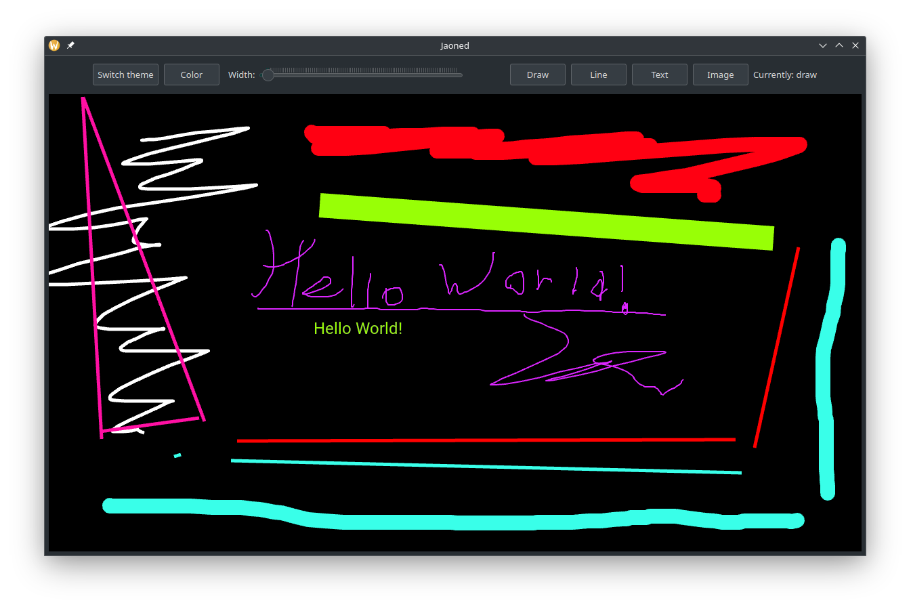

# Jaoned - an OpenGL & QT based drawing board

## The project is currently under active development

About to add online features

[The server](https://github.com/vadniks/JaonedServer)

## Screenshots

## Build

Standard CMake + GNU Make build, nothing special, QT and FreeType libraries required
